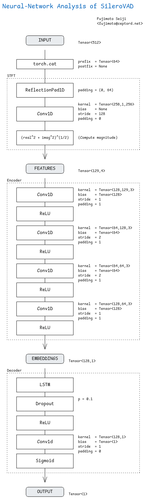

# ggml-python-dev

## 2025-08-08 Silero VAD



## 2025-07-21 Backend Interface (Graph Processing)

The main entry point is `ggml_backend_graph_compute()`. What this function
does is to kick an executor asynchronously and wait for them:

```c
enum ggml_status ggml_backend_graph_compute(ggml_backend_t backend, struct ggml_cgraph * cgraph) {
    enum ggml_status err = ggml_backend_graph_compute_async(backend, cgraph);
    ggml_backend_synchronize(backend);
    return err;
}
```

**struct ggml_cplan**

* This is actually CPU only.
* It's not exactly an "execution plan", but essentially an manager that
  holds references to threads and working memory.

```c
struct ggml_cplan {
    size_t    work_size; // size of work buffer, calculated by `ggml_graph_plan()`
    uint8_t * work_data; // work buffer, to be allocated by caller before calling to `ggml_graph_compute()`

    int n_threads;
    struct ggml_threadpool * threadpool;

    // abort ggml_graph_compute when true
    ggml_abort_callback abort_callback;
    void *              abort_callback_data;
};
```

**How does ggml process a tensor using multiple threads?**

* What's surprising to me was that ggml does NOT distribute tasks to workers.
  In other words, the computation model is not task pararellism.

* Instead, each task is horizontally spread across threads. Each thread takes
  a bit of the task and process them. (For example: When adding up two tensors,
  ith-thread will compute every ith element).

* This makes lots sense, because most Tensor (or Matrix) operations can be
  decomposed into smaller units very naturally.

## 2025-07-20 Backend Interface

Major Components:

- **Registry** (`ggml_backend_reg_t`)

  - Manage a list of GPUs available.
  - An empty skelton on CPU-based backends.

- **Device** (`ggml_backend_dev_t`)

  - Represent a single GPU.
  - Define how to allocate memory, supported operations and etc.

- **Buffer Type** (`ggml_backend_buffer_type_t`)

  - Allocate and manage working memory.
  - Manage a number of **Buffers** (see below)

- **Buffer** (`ggml_backend_buffer_t`)

  - Represent a single continuous chunk of memory.

- **Tensor Allocator** (`struct ggml_tallocr`)

  - Manage the unused space of a buffer.

List of available ggml backends (as of Jun 2025):

| Name       | Platform  | Description |
| ---------- | --------- | ----------- |
| ggml-cpu`  | CPU       | Always Available |
| ggml-blas  | CPU       | OpenBLAS, BLIS, MKL (Intel) and NVPL (Nvidia Grace) |
| ggml-cann  | NPU       | For Huawei's NPU chips |
| ggml-cuda  | GPU       | For Nvidia GPUs |
| ggml-hip   | GPU       | For AMD and Nvidia GPUs |
| ggml-metal | GPU       | For Apple Metal Accelerator |
| ggml-musa  | GPU       | For Moore Threads's GPU chips |
| ggml-opencl| VARIOUS   | A standard interface from Khronos Group |
| ggml-vulkan| GPU       | A standard interface from Khronos Group |
| ggml-sycl  | CPU/GPU   | A higher wrapper from Khronos Group |
| ggml-rpc   | N/A       | Serve ggml over TCP |

## 2025-07-19 Interface Memo (2)

### `enum ggml_status ggml_graph_compute_with_ctx(struct ggml_context * ctx, struct ggml_cgraph * cgraph, int n_threads)`

Execute the computation. A couple of notes:

1. Inside the call, it attempts to allocate a working buffer (required
   to compute the final result) from `ctx.mem_buffer`.

2. The caller must ensure that `ctx.mem_buffer` has an enough space.

**Return Value:**

```
ggml_status {
    GGML_STATUS_ALLOC_FAILED = -2,
    GGML_STATUS_FAILED = -1,
    GGML_STATUS_SUCCESS = 0,
    GGML_STATUS_ABORTED = 1,
};
```

### `void ggml_build_forward_expand(struct ggml_cgraph * cgraph, struct ggml_tensor * tensor)`

Mark a tensor (and its parents) as "to be computated".

*Note:* "expand" means "append this tensor to the target list" i.e.
avoid overwriting existing nodes marked to be computed.

## 2025-07-18 Interface Memo

### `struct ggml_cgraph * ggml_new_graph(struct ggml_context * ctx)`

Create an empty computation graph.

**Parameters:**

* `ggml_context`

  * The context object

**Return Value:**

A new `ggml_cgraph` object.

### `struct ggml_context * ggml_init (struct ggml_init_params params)`

Create a new `ggml_context` object.

A context object manages a memory buffer used for the tensor computation.
You can preallocate a memory buffer and pass it to this function call, or
let ggml to manage it internally.

**Parameters:**

* `ggml_init_params`

  * `mem_size <size_t>` : The size of the memory buffer in bytes
  * `mem_buffer <void *>`: A pre-allocated memory buffer. If NULL,
     ggml will allocate a memory pool internally.
  * `no_alloc <bool>`: Set true to avoid allocating tensor data in
     context's memory pool.

**Return Value:**

A `ggml_context` object

_Note:_ If the function fails to allocate the context struct, it calls abort(3).

## 2025-07-16 Big Picture

- Make GGML (essentially a fast tensor library for edge devices) easier
  to use from Python.

- Fiddle around GGML and have a bit of fun.
